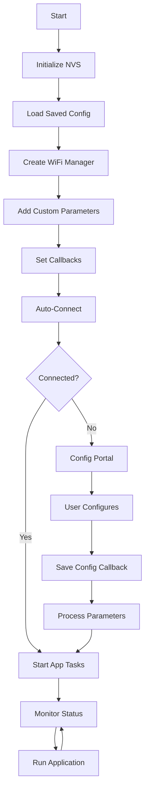

# Advanced WiFi Manager Features Example

This example demonstrates the advanced capabilities of the ESP32 WiFi Manager component, including custom configuration parameters, event callbacks, and real-time status monitoring.

## 🎯 Features Demonstrated

### Configuration Management

- ✅ **Custom Parameters** - MQTT broker settings, device name, update intervals
- ✅ **Parameter Validation** - Input validation and default value handling
- ✅ **Persistent Storage** - Save/load configuration from NVS
- ✅ **Real-time Updates** - Configuration changes applied immediately

### Event Handling

- ✅ **Save Callbacks** - Process configuration when user saves settings
- ✅ **AP Mode Callbacks** - Handle config portal start/stop events
- ✅ **Status Monitoring** - Real-time WiFi connection status tracking
- ✅ **Event Synchronization** - FreeRTOS event groups for task coordination

### Advanced WiFi Features

- ✅ **Auto-reconnection** - Automatic handling of connection failures
- ✅ **Signal Quality** - Minimum signal strength requirements
- ✅ **Timeout Management** - Configurable portal timeout (5 minutes)
- ✅ **Status Reporting** - Detailed connection information and diagnostics

## 📋 Configuration Parameters

This example adds the following custom parameters to the web interface:

| Parameter         | Type     | Description                     | Validation   |
| ----------------- | -------- | ------------------------------- | ------------ |
| `mqtt_server`     | Text     | MQTT broker hostname/IP         | Max 64 chars |
| `mqtt_port`       | Number   | MQTT broker port                | 1-65535      |
| `mqtt_username`   | Text     | MQTT authentication username    | Max 32 chars |
| `mqtt_password`   | Password | MQTT authentication password    | Max 32 chars |
| `device_name`     | Text     | Unique device identifier        | Max 32 chars |
| `update_interval` | Number   | Data update interval in seconds | 1-3600       |
| `enable_debug`    | Checkbox | Enable debug logging            | true/false   |

## 🔄 Application Flow



## 🚀 Getting Started

### 1. Build and Flash

```bash
# Set up ESP-IDF environment
. $HOME/esp/esp-idf/export.sh

# Copy this example to your project
cp -r examples/advanced_features/* your_project/main/

# Build and flash
idf.py build flash monitor
```

### 2. First Run (No Saved WiFi)

When you first run the example:

1. **Monitor Output**: Watch the serial monitor for connection attempts
2. **Connect to AP**: Connect your device to `ESP32-Advanced-Setup` WiFi network
3. **Open Portal**: Navigate to `http://192.168.4.1` in your web browser
4. **Configure WiFi**: Select your WiFi network and enter credentials
5. **Set Parameters**: Configure MQTT and application settings
6. **Save**: Click "Save" to store configuration and connect

### 3. Expected Serial Output

```
I (123) ADVANCED_EXAMPLE: 🎯 Advanced WiFi Manager Example Starting...
I (456) ADVANCED_EXAMPLE: 💾 NVS flash initialized
I (789) ADVANCED_EXAMPLE: ✅ WiFi Manager created successfully
I (012) ADVANCED_EXAMPLE: 🔧 WiFi Manager configured with advanced features
I (345) ADVANCED_EXAMPLE: 🚀 Starting auto-connect process...
I (678) ADVANCED_EXAMPLE: 🎉 Successfully connected to WiFi!
I (901) ADVANCED_EXAMPLE: 📶 Connected to: YourWiFiNetwork
I (234) ADVANCED_EXAMPLE: 📡 Signal strength: -45 dBm
I (567) ADVANCED_EXAMPLE: 📊 Application running with configuration:
I (890) ADVANCED_EXAMPLE:   📡 MQTT Server: broker.mqtt.cool:1883
I (123) ADVANCED_EXAMPLE:   📱 Device Name: ESP32-Advanced
I (456) ADVANCED_EXAMPLE:   ⏱️ Update Interval: 30s
```

### 4. Configuration Portal Interface

The web interface will show:

- **WiFi Networks**: Available networks with signal strength
- **Connection Form**: SSID and password fields
- **Custom Parameters**: All your MQTT and device settings
- **Save Button**: Store configuration and connect

## 🔧 Customization

### Adding New Parameters

```c
// Add a new parameter for sensor calibration
wifi_manager_add_parameter(wm, "sensor_offset", "Sensor Offset",
                          "0.0", 10, "type='number' step='0.1'", NULL);
```

### Custom Validation

```c
void save_config_callback(void) {
    char temp[32];
    if (wifi_manager_get_parameter_value("sensor_offset", temp, sizeof(temp)) == ESP_OK) {
        float offset = atof(temp);
        if (offset < -10.0 || offset > 10.0) {
            ESP_LOGW(TAG, "Sensor offset out of range, using 0.0");
            offset = 0.0;
        }
        app_config.sensor_offset = offset;
    }
}
```

### Status Monitoring

```c
void check_connectivity(void) {
    wifi_manager_status_t status = wifi_manager_get_status();

    switch (status) {
        case WIFI_STATUS_CONNECTED:
            // Connected - proceed with application logic
            break;
        case WIFI_STATUS_CONNECTING:
            // Still connecting - wait
            break;
        case WIFI_STATUS_DISCONNECTED:
            // Disconnected - WiFi Manager will auto-reconnect
            ESP_LOGW(TAG, "WiFi disconnected, reconnecting...");
            break;
    }
}
```

## 📱 Web Interface Features

### Parameter Types

The example demonstrates various HTML input types:

- **Text inputs**: For strings like hostnames and usernames
- **Number inputs**: With min/max validation for ports and intervals
- **Password inputs**: Hidden input for sensitive data
- **Checkboxes**: For boolean flags like debug enable

### Real-time Feedback

- Network scanning updates automatically
- Signal strength indicators
- Connection status messages
- Parameter validation feedback

## 🐛 Debugging

### Enable Debug Logging

Set the debug checkbox in the web interface, or programmatically:

```c
esp_log_level_set("*", ESP_LOG_DEBUG);
```

### Monitor WiFi Events

The example includes a dedicated monitoring task that logs WiFi status every 5 seconds.

### Check Configuration

Verify saved parameters:

```c
char value[64];
if (wifi_manager_get_parameter_value("mqtt_server", value, sizeof(value)) == ESP_OK) {
    ESP_LOGI(TAG, "MQTT Server: %s", value);
}
```

## 🎛️ Configuration Tips

### Portal Timeout

- Default: 300 seconds (5 minutes)
- Increase for complex setup: `wifi_manager_set_config_portal_timeout(wm, 600)`
- Set to 0 for no timeout (manual reset required)

### Signal Quality

- Default: 8% minimum signal strength
- Increase for better reliability: `wifi_manager_set_minimum_signal_quality(wm, 20)`
- Networks below threshold won't appear in scan results

### Memory Management

- The example uses static configuration structure
- For dynamic parameters, implement proper memory management
- Monitor heap usage with `esp_get_free_heap_size()`

## 🔄 Next Steps

After understanding this example:

1. **Integrate MQTT**: Use the configured MQTT parameters to connect to a broker
2. **Add Sensors**: Implement actual sensor reading and data publishing
3. **OTA Updates**: Add over-the-air update capability
4. **Web Dashboard**: Create a status/control web interface
5. **Security**: Implement proper certificate validation for MQTT over SSL

## 📚 Related Examples

- **Basic Usage**: Simple WiFi connection without custom parameters
- **OTA Example**: Firmware updates over WiFi
- **MQTT Integration**: Complete IoT device example
- **Display Integration**: Show WiFi status on OLED/LCD display

## 🤝 Contributing

Found issues or have improvements? Please contribute:

- Report bugs via GitHub issues
- Submit pull requests for enhancements
- Share your custom parameter implementations
- Help improve documentation and examples
